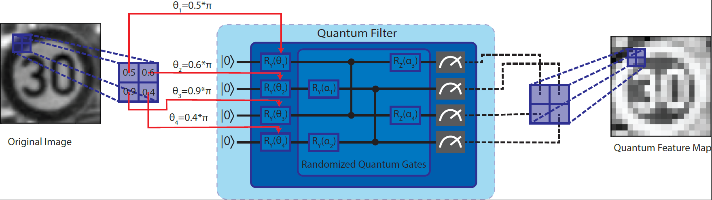
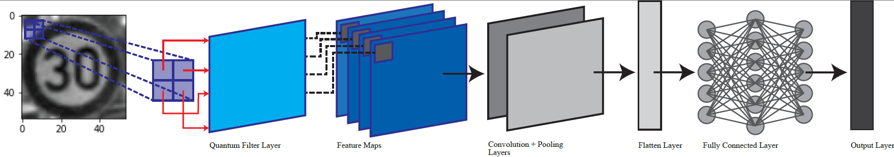
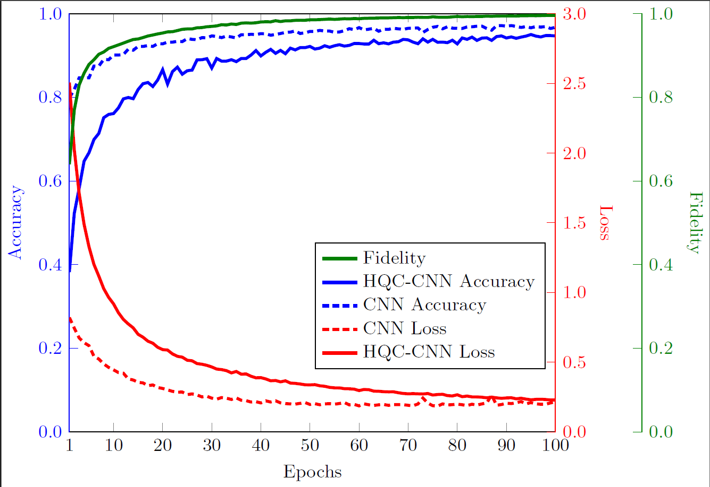
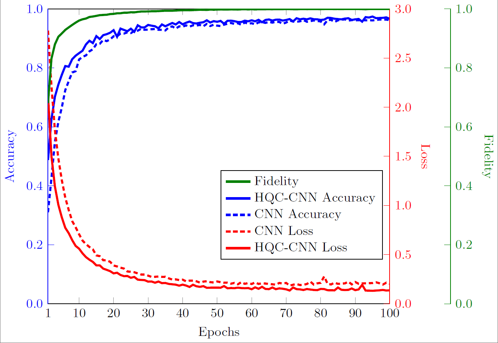

# Hybrid Quantum Convolutional Neural Network (HQCNN)

This repository contains the implementation of a Hybrid Quantum Convolutional Neural Network (HQCNN) architecture developed for traffic sign image classification using quantum and classical components.

## Overview

HQCNN integrates quantum unitary operations with a classical Convolutional Neural Network (CNN) to enhance the feature extraction capabilities of traffic sign image classification. The quantum unitary operations act as convolutional filters, extracting features from spatially localized image segments, while the classical CNN processes these quantum-generated feature maps for final classification.

### HQCNN Framework

The HQCNN framework consists of a **Quantum Neural Network (QNN)** or **quantum layer** followed by a standard CNN. Below is a detailed explanation of each component:

1. **Quantum Layer**: 
   - The quantum layer is divided into input encoding, random unitary operations, and quantum circuit measurements.
     - **Input Encoding**: The image data is encoded into quantum states using **angle encoding** with Pauli-Y rotation gates.
     - **Random Quantum Circuits**: The encoded quantum state undergoes unitary transformations using random quantum circuits. In this project we uused Pauli-X and Pauli-Z rotation gates. These circuits extract significant features from small, localized segments of the image.
     - **Quantum Measurement**: The final step collapses the quantum state into classical information. The expectation values of these measurements form the quantum feature map, which serves as the output for this layer.

     Quantum Layer

2. **Classical CNN**: 
   - The quantum feature maps (output from the quantum layer) are then passed to a standard CNN for further feature extraction and classification. The classical CNN consists of a convolution layer, max pooling, flattening, and dense layers with softmax activation for classification.

    HQCNN Architecture

## Experiment Details

- **Dataset**: We used the **German Traffic Sign Recognition Benchmark (GTSRB)** dataset, consisting of over 50,000 real-world images of traffic signs in 43 classes. For our experiment, we filtered out classes with fewer than 500 images, resulting in 23 classes with a total of 33,000 images. The data was split into training and validation sets in an 8:2 ratio.
- **Quantum Convolution**: 
  - Images were encoded into quantum states using angle embedding with Ry rotation gates.
  - A 2×2 kernel and a stride of 2 were used, and a quantum circuit with four qubits processed the pixel data. The output was a 14×14×4 quantum feature map.
- **Classical Convolution**:
  - A single classical convolution layer with max pooling, followed by a flattening and dense layer, was used for further processing and classification.
  - The model was trained with a learning rate 0.0001 and a batch size of 30 images for 100 epochs.

## Results

The performance of HQCNN was assessed using the cross-entropy loss function, accuracy, and average semantic fidelity at each epoch. Below are the comparison plots for different kernel sizes (2x2 and 3x3), showing fidelity, accuracy, and loss metrics.

|||
|:-:|:-:|
|Kernel 2x2|Kernel 3x3|

